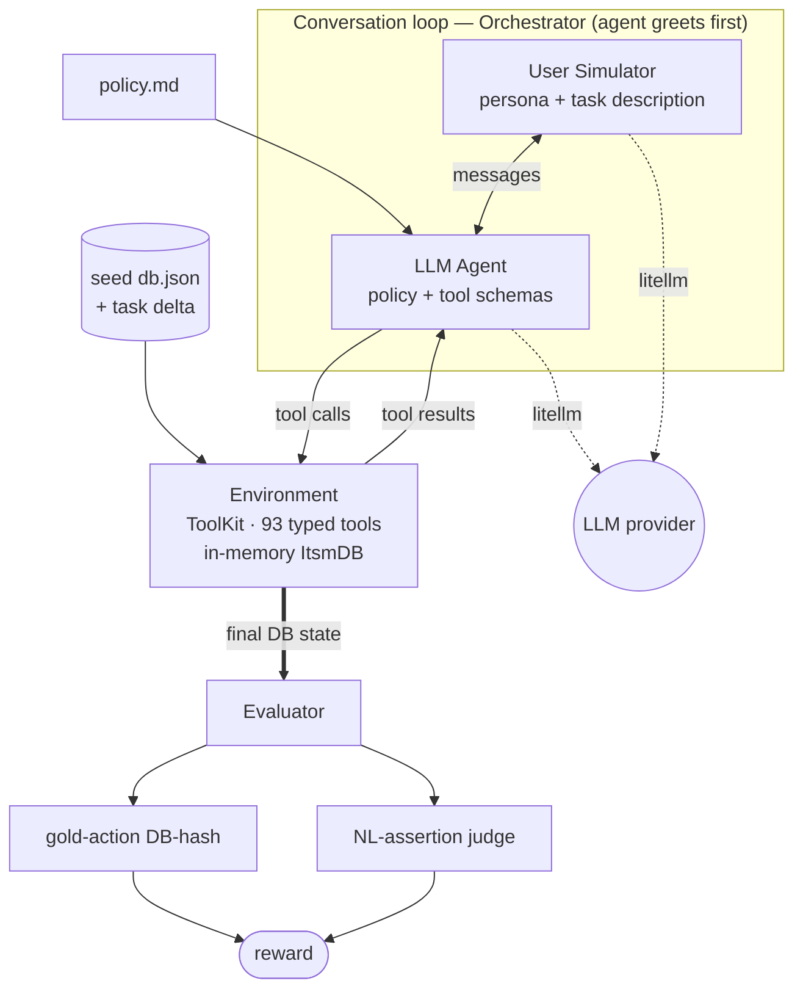

## EnterpriseOps Gym 2

EnterpriseOps Gym 2 is a benchmark for evaluating LLM agents on stateful, multi-step
enterprise-operations workflows: an agent talks to a simulated user, operates on an in-memory
domain database through typed tools, and is scored against gold criteria.

Each domain specifies:

- A **policy** the agent must follow (`data/<domain>/policy.md`)
- A set of **tools** the agent can use (in-memory, pydantic-typed)
- A set of **tasks** with evaluation criteria


## Architecture

A run drives a turn-based loop — **user simulator ↔ agent ↔ environment (tools + DB)** — then
scores the final database state. The agent and user simulator are LLMs (via litellm); the
environment and evaluator are pure in-memory Python (no Docker, no SQL server at runtime).



## Setup

Requires Python 3.11+ and (recommended) [uv](https://docs.astral.sh/uv/).

```bash
uv venv --python 3.12 .venv
uv pip install -e ".[dev]"
```

Put provider credentials in a `.env` at the repo root (gitignored) to run live evals:

```bash
OPENAI_API_KEY=sk-...
# any litellm-supported provider works (gpt-4o, anthropic/claude-..., bedrock/..., etc.)
```

Models are resolved by [litellm](https://docs.litellm.ai/), so any provider string works.

## The `eops` CLI

```bash
set -a && . ./.env && set +a              # load credentials

eops run    --domain itsm                 # run the eval over the domain's tasks
eops tasks  --domain itsm                 # list the tasks (persona, goal, criteria)
eops domain itsm                          # print the domain policy
```

`eops run` ties together a litellm tool-calling agent, the user simulator, the environment, and
the evaluator. Useful flags:

| Flag | Default | Description |
|------|---------|-------------|
| `--domain`, `-d` | `itsm` | Domain to evaluate |
| `--agent-llm` | `gpt-4o` | LLM for the agent (must support tool calling) |
| `--user-llm` | `gpt-4o-mini` | LLM for the user simulator |
| `--judge-llm` | `gpt-4o-mini` | LLM for the NL-assertion judge |
| `--task-ids` | all | Run only these task ids |
| `--num-tasks` | all | Run at most N tasks |
| `--max-steps` | `12` | Max conversation steps per task |
| `--k` | `1` | Trials (rollouts) per task; `>1` reports `pass^k` |
| `--seed` | — | Base seed; trial `i` uses `seed+i` (best-effort per provider) |
| `--save-to` | — | Write all results (trajectories + rewards) to one JSON file |
| `--log-dir` | — | Write a structured run dir: `summary.json` + per task/trial trajectories |
| `--verbose`, `-v` | off | Print each task's conversation |

```bash
eops run --domain itsm --num-tasks 1 --verbose --save-to results.json
```

**Scoring**: reward = gold-action full-DB-hash match × NL assertions. A task passes (reward 1.0)
only if the agent's end-state matches the gold replay of the task's `actions` **and** every NL
assertion is met. Either criterion may be omitted by a task, in which case it doesn't gate.

**Multiple rollouts**: pass `--k N` to run each task `N` times; the summary then reports the
`pass^k` reliability curve (`C(c,j)/C(n,j)`, averaged over tasks) alongside `avg_reward`. Add
`--log-dir DIR` to persist a run: `DIR/summary.json` (metadata + metrics) plus
`DIR/<task_id>/trial_<i>.json` for every run.

### Running with a specific provider

Set credentials in `.env` (see `.env.example`), `set -a && . ./.env && set +a`, then pick models
with the `--*-llm` flags. The defaults are OpenAI (`gpt-4o`/`gpt-4o-mini`), so for any other
provider you must pass the flags explicitly.

```bash
# OpenAI (default models — no flags needed)
#   .env: OPENAI_API_KEY=sk-...
eops run --domain itsm --num-tasks 1 -v

# Anthropic — standard API key
#   .env: ANTHROPIC_API_KEY=sk-ant-api03-...
eops run --domain itsm --num-tasks 1 -v \
    --agent-llm anthropic/claude-sonnet-4-5 \
    --user-llm  anthropic/claude-haiku-4-5 \
    --judge-llm anthropic/claude-haiku-4-5

```


### Programmatic API

```python
from eops_gym.domains.itsm.environment import get_tasks
from eops_gym.run import run_task

task = get_tasks()[0]
result = run_task("itsm", task, agent_llm="gpt-4o")
print(result.reward)
```

`examples/run_eval.py` runs one task end to end (override models via `AGENT_MODEL` / `USER_MODEL`
/ `JUDGE_MODEL`).

## How a task is defined

Tasks are loaded by `get_tasks()` from two optional, merged sources: `data/itsm/tasks.json`
(a JSON list) and a `data/itsm/tasks/` directory (each `*.json` holds one task or a list of
tasks). Duplicate ids across the sources are rejected. Each task specifies:

- a **scenario** — a persona (`name`, `personality`, and a free-form **`known_info`** dict) plus
  a natural-language task description, all fed to the user simulator. `known_info` holds facts the
  user knows and reveals when asked (their `user_id`, email, an incident number, …) so the
  simulator never invents ids. Its `user_id` also becomes the **authenticated caller** for the
  tools (org scoping + default attribution: requested_by on changes, opened_by on problems,
  notification sender) — exposed as the derived `Task.acting_user_id`,
- an optional **initial_state_delta** applied over `db.json` (`set` / `create` / `delete`),
- **evaluation_criteria**: two signals —
  - **actions** — a correct gold tool-call sequence, replayed to compute a target DB state for
    hash matching.
  - **nl_assertions** — natural-language outcomes graded by an LLM judge.

## Evaluation

The reward is the product of the two criteria a task defines; all defined checks gate.

- **DB-match** (`evaluator/evaluator_env.py`): replays the task's gold `actions` on a fresh
  seed+delta env and compares its DB hash to the run's final DB. Tools generate IDs/timestamps
  deterministically so gold replay is reproducible.
- **NL assertions** (`evaluator/evaluator_nl.py`): an LLM judge grades each assertion against the
  conversation.

