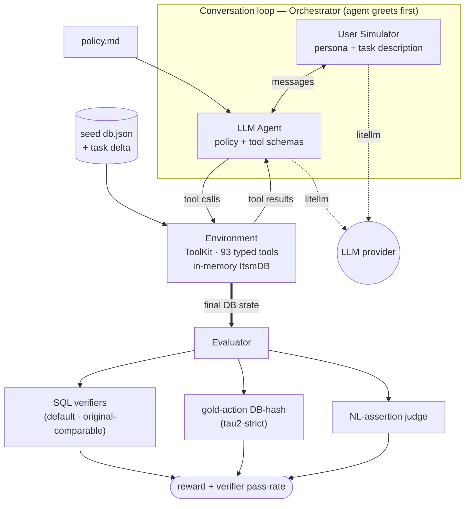

## EnterpriseOps Gym 2

EnterpriseOps Gym 2 is a **tau2-bench-style** benchmark for evaluating LLM agents on stateful,
multi-step enterprise-operations workflows. It is a faithful port of ServiceNow's
[EnterpriseOps-Gym](https://github.com/ServiceNow/EnterpriseOps-Gym) into the tau2 architecture:
an agent talks to a simulated user, operates on an in-memory domain database through typed tools,
and is scored against gold criteria.

Each domain specifies:

- A **policy** the agent must follow (`data/<domain>/policy.md`)
- A set of **tools** the agent can use (in-memory, pydantic-typed)
- A set of **tasks** with evaluation criteria

### Domains

| Domain | Tools | DB tables | Tasks |
|--------|------:|----------:|------:|
| **ITSM** (IT Service Management) | 93 | 24 | 12 |

The ITSM domain is a faithful reimplementation of the original ServiceNow ITSM MCP server:
the database schema and tool behaviour were **extracted from the live MCP and differential-tested
to byte-for-byte parity** (see "Provenance" below).

## Architecture

A run drives a turn-based loop — **user simulator ↔ agent ↔ environment (tools + DB)** — then
scores the final database state. The agent and user simulator are LLMs (via litellm); the
environment and evaluator are pure in-memory Python (no Docker, no SQL server at runtime).



The original benchmark instead ran a Dockerized MCP server per domain (SQLite over HTTP, scored
by SQL verifiers). This port collapses all of that into the in-process pieces above; the Docker
MCP is used only at build/test time as a fidelity oracle (see "Provenance" / "Tests").

## Setup

Requires Python 3.11+ and (recommended) [uv](https://docs.astral.sh/uv/).

```bash
uv venv --python 3.12 .venv
uv pip install -e ".[dev]"
```

Put provider credentials in a `.env` at the repo root (gitignored) to run live evals:

```bash
OPENAI_API_KEY=sk-...
# any litellm-supported provider works (gpt-4o, anthropic/claude-..., bedrock/..., etc.)
```

Models are resolved by [litellm](https://docs.litellm.ai/), so any provider string works.

## The `eops` CLI

```bash
set -a && . ./.env && set +a              # load credentials

eops run    --domain itsm                 # run the eval over the domain's tasks
eops tasks  --domain itsm                 # list the tasks (persona, goal, criteria)
eops domain itsm                          # print the domain policy
```

`eops run` ties together a litellm tool-calling agent, the user simulator, the environment, and
the evaluator. Useful flags:

| Flag | Default | Description |
|------|---------|-------------|
| `--domain`, `-d` | `itsm` | Domain to evaluate |
| `--agent-llm` | `gpt-4o` | LLM for the agent (must support tool calling) |
| `--user-llm` | `gpt-4o-mini` | LLM for the user simulator |
| `--judge-llm` | `gpt-4o-mini` | LLM for the NL-assertion judge |
| `--reward-mode` | `verifier` | `verifier` (original SQL verifiers — comparable) or `db_hash` (tau2-strict) |
| `--task-ids` | all | Run only these task ids |
| `--num-tasks` | all | Run at most N tasks |
| `--max-steps` | `12` | Max conversation steps per task |
| `--save-to` | — | Write full results (trajectories + rewards) to JSON |
| `--verbose`, `-v` | off | Print each task's conversation |

```bash
eops run --domain itsm --num-tasks 1 --verbose --save-to results.json
```

**Scoring modes** (`--reward-mode`):
- **`verifier`** (default): a task succeeds iff all of its original SQL verifiers pass — directly
  comparable to the original EnterpriseOps leaderboard. The summary also reports the average
  per-verifier pass rate. NL assertions are computed for info but do not gate the reward.
- **`db_hash`** (tau2-strict): reward = gold-action full-DB-hash match × NL assertions; passes
  only if the agent's *entire* end-state matches the gold replay. Stricter (it also penalizes
  fields a task never required), so its numbers are **not** comparable to the original.

### Running with a specific provider

Set credentials in `.env` (see `.env.example`), `set -a && . ./.env && set +a`, then pick models
with the `--*-llm` flags. The defaults are OpenAI (`gpt-4o`/`gpt-4o-mini`), so for any other
provider you must pass the flags explicitly.

```bash
# OpenAI (default models — no flags needed)
#   .env: OPENAI_API_KEY=sk-...
eops run --domain itsm --num-tasks 1 -v

# Anthropic — standard API key
#   .env: ANTHROPIC_API_KEY=sk-ant-api03-...
eops run --domain itsm --num-tasks 1 -v \
    --agent-llm anthropic/claude-sonnet-4-5 \
    --user-llm  anthropic/claude-haiku-4-5 \
    --judge-llm anthropic/claude-haiku-4-5

# Anthropic — OAuth token (Claude Pro/Max/Code); litellm auto-detects the sk-ant-oat prefix
#   .env: ANTHROPIC_API_KEY=sk-ant-oat01-...
#   (subscription tokens are for interactive use — may hit usage/rate limits for bulk evals)
eops run --domain itsm --num-tasks 1 -v \
    --agent-llm anthropic/claude-sonnet-4-5 \
    --user-llm  anthropic/claude-haiku-4-5 \
    --judge-llm anthropic/claude-haiku-4-5

# Sarvam (OpenAI-compatible endpoint) — use a tool-calling model: sarvam-105b or sarvam-30b
#   (NOT sarvam-m — it does not support tool calling, which the agent requires)
#   .env: OPENAI_API_KEY=<sarvam-key>   OPENAI_BASE_URL=https://api.sarvam.ai/v1
eops run --domain itsm --num-tasks 1 -v \
    --agent-llm openai/sarvam-105b \
    --user-llm  openai/sarvam-30b \
    --judge-llm openai/sarvam-30b

# Full run (all 12 tasks), save trajectories + rewards
eops run --domain itsm --agent-llm anthropic/claude-sonnet-4-5 \
    --user-llm anthropic/claude-haiku-4-5 --judge-llm anthropic/claude-haiku-4-5 \
    --save-to results.json
```

> The **agent** model must support tool/function calling (it drives the gym via tools). The user
> simulator and NL judge do not.

### Programmatic API

```python
from eops_gym.domains.itsm.environment import get_tasks
from eops_gym.run import run_task

task = get_tasks()[0]
result = run_task("itsm", task, agent_llm="gpt-4o")
print(result.reward)
```

`examples/run_eval.py` runs one task end to end (override models via `AGENT_MODEL` / `USER_MODEL`
/ `JUDGE_MODEL`).

## How a task is defined

Tasks live in `data/itsm/tasks.json`. Each task specifies:

- a **user scenario** (persona + natural-language task description, fed to the user simulator),
- an **environment** (`{seed, acting_user_id}`) selecting the seed DB and authenticated caller,
- optional **selected_tools** (oracle-mode subset shown to the agent),
- an optional **initial_state_delta** applied over the seed (`set` / `create` / `delete`),
- **evaluation_criteria**: three signals —
  - **verifiers** — the original benchmark's `database_state` SQL checks (`{query, expected_value,
    comparison_type}`); gate the default reward.
  - **actions** — a correct gold tool-call sequence, replayed to compute a target DB state for
    hash matching (tau2-strict mode).
  - **nl_assertions** — natural-language outcomes graded by an LLM judge.

## Evaluation

The default reward mode is **`verifier`** (see `--reward-mode` above); all checks are computed
for information regardless.

- **Verifiers** (`evaluator/evaluator_verifier.py`): materializes the final in-memory DB into a
  throwaway SQLite (schema inferred from the pydantic models) and runs the original SQL verifiers.
  Reports task success (all pass) + per-verifier pass rate — comparable to the original benchmark.
- **DB-match** (`evaluator/evaluator_env.py`): replays the task's gold `actions` on a fresh
  seed+delta env and compares its DB hash to the run's final DB. Tools generate IDs/timestamps
  deterministically so gold replay is reproducible.
- **NL assertions** (`evaluator/evaluator_nl.py`): an LLM judge grades each assertion against the
  conversation.

## Repository structure

```
EnterpriseOps-Gym-2/
├── src/eops_gym/                     # the framework + domains (installable package)
│   ├── cli.py                        # `eops run | tasks | domain`
│   ├── run.py                        # per-task runner; DOMAINS registry; RunResults
│   ├── config.py                     # default models + max_tokens
│   ├── data_model/
│   │   ├── message.py                # System/User/Assistant/Tool messages, ToolCall
│   │   └── tasks.py                  # Task, UserScenario/UserProfile, Action, EvaluationCriteria
│   ├── environment/
│   │   ├── db.py                     # DB base (pydantic, hashable)
│   │   ├── delta.py                  # per-task seed patch: set / create / delete
│   │   ├── toolkit.py                # @is_tool decorator + metaclass that collects tools
│   │   ├── tool.py                   # typed OpenAI schema generation (type hints + docstrings)
│   │   └── environment.py            # wraps a toolkit; dispatches ToolCall → result
│   ├── agent/llm_agent.py            # litellm tool-calling agent
│   ├── user/user_simulator.py        # LLM persona role-play (emits ###STOP### to end)
│   ├── orchestrator/orchestrator.py  # the conversation loop (agent greets first)
│   ├── evaluator/
│   │   ├── evaluator.py              # combines checks → RewardInfo (selects reward_mode)
│   │   ├── evaluator_env.py          # gold-action replay → DB-hash match
│   │   ├── evaluator_nl.py           # NL-assertion LLM judge
│   │   └── evaluator_verifier.py     # original SQL verifiers (DB → in-memory SQLite)
│   ├── utils/                        # clock (deterministic), hashing, io, litellm wrapper
│   └── domains/itsm/
│       ├── data_model.py             # 24 pydantic tables + ItsmDB
│       ├── environment.py            # get_environment(seed, acting_user) + get_tasks()
│       └── tools/                    # 19 category modules (_base + incidents, users, …) = 93 tools
├── data/itsm/                        # domain content
│   ├── policy.md                     # agent policy (the ITIL system prompt)
│   ├── tasks.json                    # the 12 ported tasks (what get_tasks() loads)
│   ├── ported_tasks/                 # per-task source files (assembled → tasks.json)
│   └── seeds/                        # seed_main.json (241 rec) · seed_alt.json (914 rec)
├── docs/                             # ground truth extracted from the live MCP (provenance)
│   ├── itsm_schema.sql               # authoritative 24-table DDL
│   ├── itsm_tool_catalog.json        # 93 tools + signatures
│   └── itsm_build_spec.md            # implementer contract (id schemes, defaults, validation)
├── scripts/                          # sql_seed_to_db_json · assemble_tasks · add_verifiers_to_tasks
├── tests/                            # offline regression net + Docker-gated conformance
│   ├── test_framework.py             # framework units (schema, clock, delta, hashing, eval)
│   ├── test_agent_user_mock.py       # agent + user-sim with a mocked LLM
│   ├── test_itsm_task_fidelity.py    # gold actions satisfy the original verifiers
│   ├── test_itsm_tasks.py            # gold-action DB-match + determinism
│   ├── test_itsm_e2e_mock.py         # full loop with a scripted agent (no LLM)
│   ├── test_itsm_*_conformance.py    # per-tool diff vs the live MCP (needs Docker, auto-skips)
│   ├── itsm_oracle.py · verifier_check.py   # test helpers
│   └── fixtures/                     # original-verifiers snapshot
├── examples/run_eval.py
└── pyproject.toml · .env.example
```

**Where things live:** *structure & behaviour* → `src/`; *content* (policy, seeds, tasks) →
`data/itsm/`; *provenance* (extracted ground truth) → `docs/`.

## Tests

```bash
.venv/bin/python -m pytest -q
```

- **Offline** tests (no API key, no Docker) — the always-on regression net:
  - `test_itsm_task_fidelity.py` — each task's gold actions satisfy the ORIGINAL SQL verifiers
    (snapshotted in `tests/fixtures/`); the core "faithful port" gate.
  - `test_itsm_tasks.py` — gold-action DB-match + determinism per task.
  - `test_itsm_e2e_mock.py` — full orchestrator→environment→evaluator loop with a scripted agent.
  - `test_framework.py` — tool-schema generation, clock, delta (+ error paths), DB hashing,
    message↔litellm conversion, evaluator reward combination.
  - `test_agent_user_mock.py` — `LLMAgent`/`UserSimulator` + litellm parsing with a mocked LLM.
- **Differential conformance** tests (`test_itsm_<category>_conformance.py`,
  `test_itsm_integrated_conformance.py`) compare every tool against the **live MCP oracle** and
  are **skipped automatically** if the oracle is not running. To run them, start the original MCP
  image and expose it on `:8016`:
  ```bash
  docker run -d --name eops-itsm --platform linux/amd64 -p 8016:8005 \
      shivakrishnareddyma225/enterpriseops-gym-mcp-itsm:latest
  ```

## Provenance (how the ITSM port was built)

The original benchmark's tool logic and DB schema live only in a Docker MCP image (the repo ships
INSERT-only seed SQL). To port faithfully, we:

1. **Extracted** the authoritative schema (`docs/itsm_schema.sql`), the 93-tool catalog
   (`docs/itsm_tool_catalog.json`), and the exact write-tool behaviour from the live MCP.
2. **Reimplemented** the 24-table pydantic DB and all 93 tools (one module per MCP category)
   with deterministic IDs/timestamps, and **differential-tested every tool to byte-for-byte DB
   parity** against the live MCP (`tests/itsm_oracle.py`).
3. **Ported** the seed data (SQL → typed `db.json`) and the policy, and **converted** each task's
   SQL verifiers into tau2 gold actions, validated so the gold actions satisfy the original
   verifiers (`tests/verifier_check.py`).

## Adding a domain

Mirror `domains/itsm/`: a `data_model.py` (pydantic DB), a `tools/` package of `@is_tool`
mixins, an `environment.py` factory, `data/<domain>/{policy.md,seeds,tasks.json}`, and register
it in `run.py`'s `DOMAINS`.
